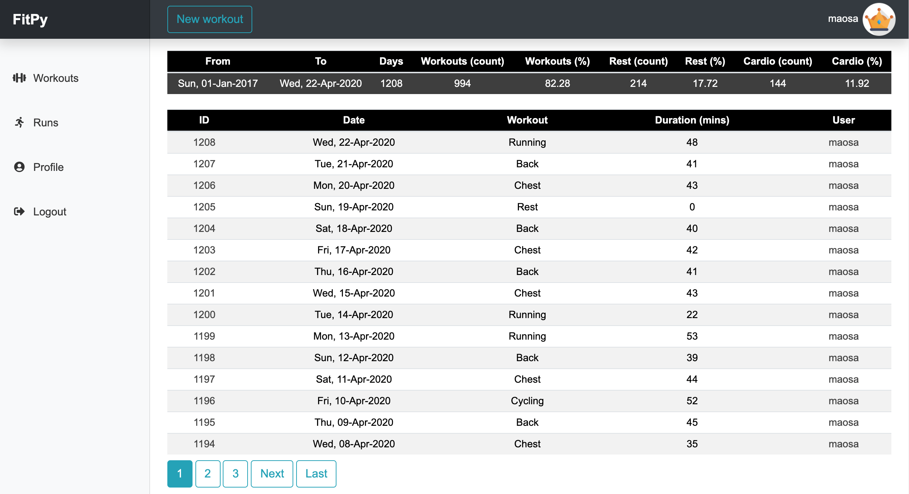
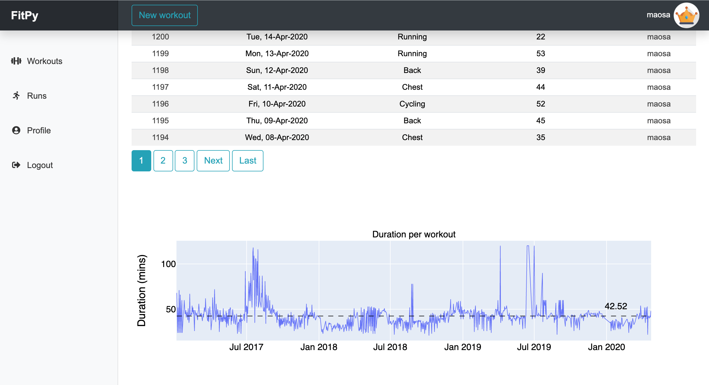
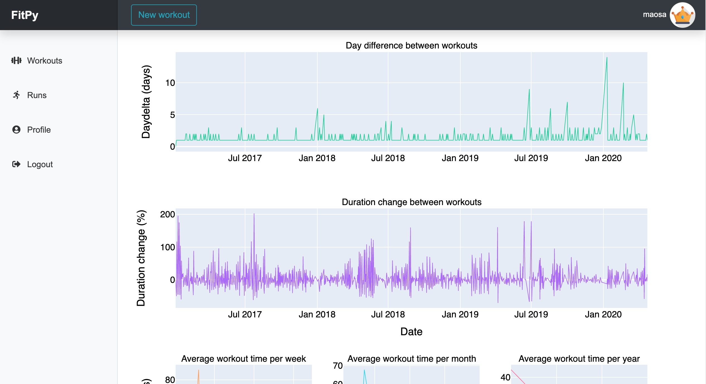
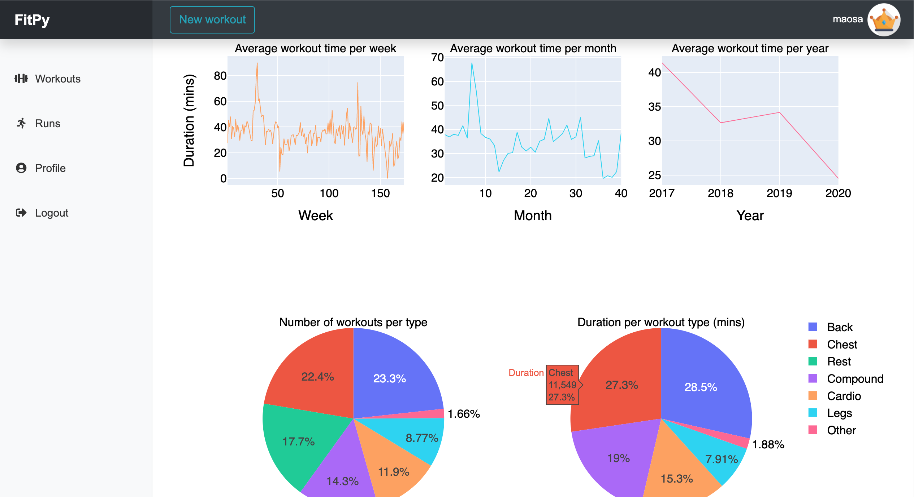
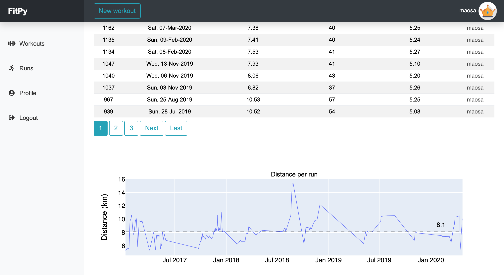
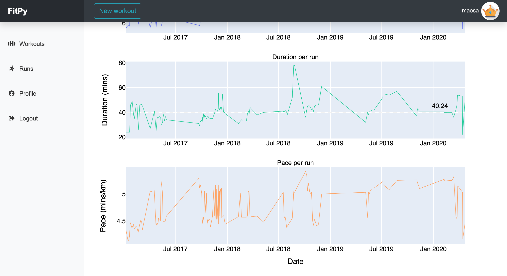
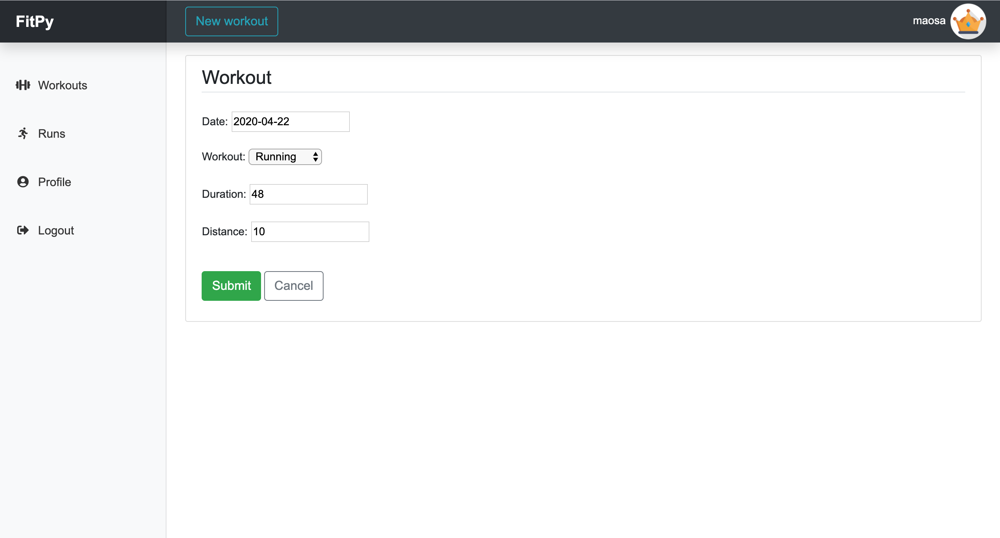
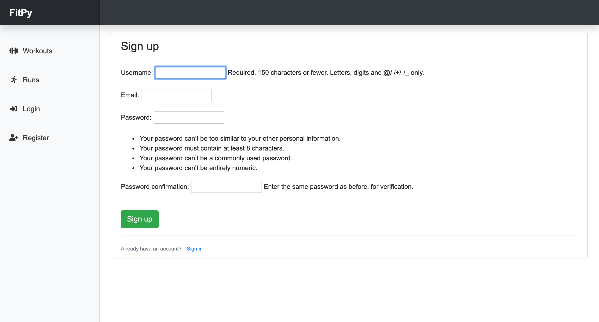
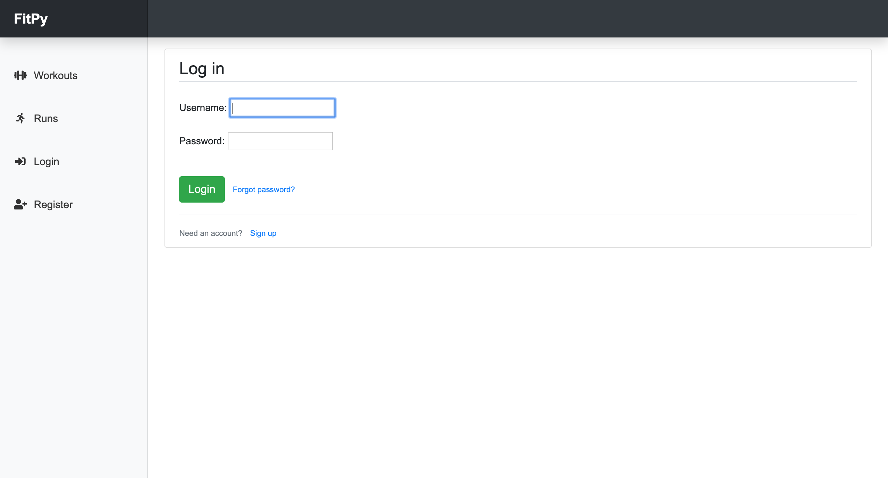

# FitPy

## **Overview:**
* This is my first Django project
* A web app for tracking my workouts
* My original workout web app was built using R Shiny and can be found at https://github.com/maosa/fitr
* Django beginners can find an excellent series of tutorials [here](https://www.youtube.com/playlist?list=PL-osiE80TeTtoQCKZ03TU5fNfx2UY6U4p)
* Fitpy is currently not hosted on a web server therefore I am posting some screenshots from the app below

## Workouts tab

## Runs tab

## Record a new workout

## User registration page

## User login page

 

 
